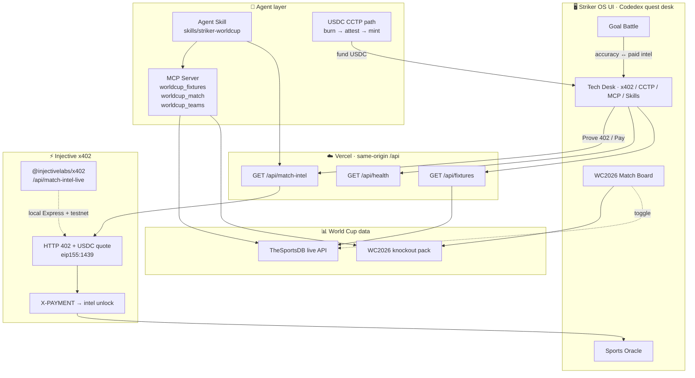
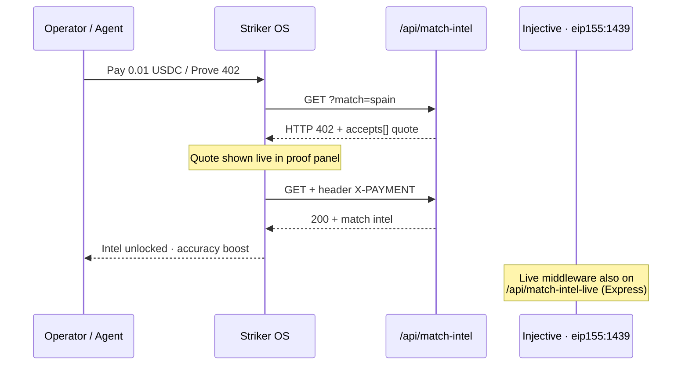

<p align="center">
  
</p>

<h1 align="center">Striker OS</h1>

<p align="center">
  <strong>World Cup intel that agents can actually buy</strong><br/>
  Built for the <a href="https://www.hackquest.io/">Injective Global Cup</a> · Live on Vercel
</p>

<p align="center">
  <a href="https://striker-os.vercel.app"></a>
  <a href="https://github.com/thesithunyein/striker-os"></a>
  
</p>

<p align="center">
  
  
  
  
  
  
  
  
</p>

<p align="center">
  <a href="https://striker-os.vercel.app">Live App</a> ·
  <a href="#architecture">Architecture</a> ·
  <a href="#how-the-injective-technologies-are-used">Injective Tech</a> ·
  <a href="#demo-path-for-judges-2-minutes">Judge Demo</a> ·
  <a href="https://vercel.com/new/clone?repository-url=https://github.com/thesithunyein/striker-os">Deploy</a>
</p>

---

Fans and AI agents get a **WC2026 match board**, an MCP tool surface, and pay‑per‑query intel gated by **Injective x402** — in one lightweight desk.

[](https://vercel.com/new/clone?repository-url=https://github.com/thesithunyein/striker-os)

---

## Architecture

End‑to‑end flow judges can click on production — no localhost required.



### x402 payment path (production)



---

## What it does / problem it solves

During a tournament, fans juggle scores and paid data feeds across tabs, and AI agents can't sign up for API keys mid‑run. Striker OS gives both a single desk:

1. **World Cup board** — WC2026 knockout fixtures (Final week) + optional live soccer API
2. **Pay‑per‑query intel** — gated by **x402** (HTTP 402 → USDC → unlock), no API keys
3. **MCP server** — live match data exposed as callable agent tools
4. **Agent Skill** — installable `striker-worldcup` skill that wires the above together
5. **CCTP** — fund the agent wallet with native USDC on Injective
6. **Goal Battle** arena for engagement clips / social demos

---

## How the Injective technologies are used

| Tech | Integration in this repo |
|------|--------------------------|
| **x402** | Official [`@injectivelabs/x402`](https://injective.com/blog/x402) middleware on `/api/match-intel-live` (local Express, Injective testnet USDC `eip155:1439`). Production site exposes the same **HTTP 402 → X-PAYMENT → unlock** handshake at `/api/match-intel` — click **Prove 402** on the live app to see the quote JSON. |
| **MCP Server** | `server/mcp-server.js` is a **real, runnable MCP server** (`@modelcontextprotocol/sdk`) exposing `worldcup_fixtures`, `worldcup_match`, `worldcup_teams`, backed by live data. Add it to Cursor/Claude via `mcp.json`. Pair with the official `@injectivelabs/mcp-server` (also in `mcp.json`) for on‑chain actions. |
| **Agent Skills** | `skills/striker-worldcup/SKILL.md` is an installable Injective‑style skill that teaches an agent to read live fixtures and pay for intel via x402. Links to `injective-usdc-integration` and `injective-mcp-servers`. |
| **USDC CCTP** | Burn → attestation → mint path into native Injective USDC to fund x402 spend, using official Injective CCTP tools (`cctp_supported_chains`, `cctp_attestation_status`, `cctp_mint`). |

### World Cup data

Primary board = **FIFA World Cup 2026 knockout pack** (`data/worldcup-2026.js`) for Final-week context and screenshots. Each fixture shows **real country flags** (PNG via [flagcdn.com](https://flagcdn.com) — works in all major browsers). Toggle **Live soccer API** (TheSportsDB) beside it. MCP tools (`worldcup_fixtures`, etc.) use the live sports module. Badge shows **WC2026** or **LIVE API**.

---

## Deploy to Vercel

The frontend is static and the API ships as **Vercel serverless functions** (`api/`), so the deployed site is fully functional on its own:

```bash
npm i -g vercel
vercel            # preview
vercel --prod     # production
```

Or import the repo at [vercel.com/new](https://vercel.com/new). Zero config — `vercel.json` handles routing.

Deployed endpoints (same‑origin, auto‑used by the UI when not on localhost):

```
GET /api/health                       # status + x402 config
GET /api/fixtures                     # live fixtures (TheSportsDB)
GET /api/match-intel?match=spain      # 402 quote → resend with X-PAYMENT to unlock
```

**Judge curl (production):**

```bash
curl -i "https://striker-os.vercel.app/api/match-intel?match=spain"
```

Optional env vars in the Vercel dashboard: `STRIKER_SPORTS_KEY`, `STRIKER_LEAGUE_ID`, `X402_PRICE`, `X402_PAY_TO`, `X402_NETWORK`.

---

## Quick start

### 1. Frontend (no build step)

```bash
python -m http.server 5173
# open http://localhost:5173
```

### 2. Backend — x402 API + live data

```bash
cd server
npm install
npm start          # http://localhost:8787
```

Test it:

```bash
curl http://localhost:8787/health
curl http://localhost:8787/api/fixtures
curl -i "http://localhost:8787/api/match-intel?match=United"
curl -H "X-PAYMENT: receipt" "http://localhost:8787/api/match-intel?match=United"
curl -i "http://localhost:8787/api/match-intel-live?match=United"
```

### 3. MCP server — live World Cup tools

```bash
cd server
npm run mcp        # stdio MCP server
```

Add to Cursor/Claude with `mcp.json` (already in the repo), then ask:

> "Use worldcup_fixtures to list upcoming matches."

---

## Repo structure

```
striker-os/
├── index.html                        # App shell (Codedex-style UI)
├── css/app.css                       # Theme
├── js/app.js                         # Wallet, x402, board, arena, oracle
├── data/worldcup-2026.js             # WC2026 knockout pack
├── assets/favicon.svg                # Brand + browser tab logo
├── api/                              # Vercel serverless API
│   ├── health.js
│   ├── fixtures.js
│   └── match-intel.js                # HTTP 402 → unlock
├── sports.cjs                        # Shared live sports helper
├── vercel.json
├── server/
│   ├── index.js                      # @injectivelabs/x402 Express API
│   ├── mcp-server.js                 # MCP tools
│   ├── worldcup.js
│   └── package.json
├── skills/striker-worldcup/SKILL.md  # Agent Skill
├── mcp.json
├── .env.example
└── README.md
```

---

## Config

Frontend (via `window.` or `localStorage`):

```js
localStorage.setItem("striker_api_endpoint", "http://localhost:8787");
localStorage.setItem("striker_sports_key", "3");
localStorage.setItem("striker_league_id", "4328");
localStorage.setItem("striker_gemini_key", "YOUR_KEY"); // optional
```

Backend: see `.env.example` (`X402_NETWORK`, `X402_PRICE`, `X402_PAY_TO`, `X402_FACILITATOR`, `X402_PRIVATE_KEY`).

---

## Demo path for judges (2 minutes)

1. Open [striker-os.vercel.app](https://striker-os.vercel.app) → **World Cup board** (WC2026 Final week)
2. **x402 tab** → **Prove 402** → live HTTP `402` JSON → **Pay** → intel unlock
3. Run the **Judge curl** above — same 402 from production
4. **MCP tab** → health JSON (`x402` + `eip155:1439`)
5. **Skills** → open `skills/striker-worldcup/SKILL.md`
6. **Goal Battle** → shoot a clip for social posts

Optional: toggle **Live soccer API** beside the WC pack.

---

## Submission checklist (Injective Global Cup)

- [ ] Typeform: https://xsxo494365r.typeform.com/to/TMaGb1du
- [ ] GitHub repo + demo link
- [ ] Demo video (Prove 402 → unlock → MCP → Goal Battle)
- [ ] X post with screenshots, GitHub link, tags `@injective` `@NinjaLabsHQ` `@NinjaLabsCN`, hashtag `#InjectiveGlobalCupHackathon`
- [ ] Mention all four tech names in the post for Points Contest bonuses
- [ ] Comment WC match screenshots under the main post

---

## Honesty note for judges

- **World Cup data:** WC2026 knockout board is primary; live TheSportsDB feed available via toggle + MCP.
- **MCP server:** fully real and runnable — add it to your client and call the tools.
- **x402:** live HTTP 402 on production (`/api/match-intel` — use Prove 402). Official `@injectivelabs/x402` middleware on `/api/match-intel-live` (local Express + testnet USDC). Settling a funded payment needs a facilitator client.
- **CCTP:** documented path + UI fund flow; mint with funded keys via Injective MCP CCTP tools.

---

## Author

**Sithu Nyein** — [sithunyein.mailto@gmail.com](mailto:sithunyein.mailto@gmail.com)

## License

MIT — built for the Injective Global Cup hackathon.
